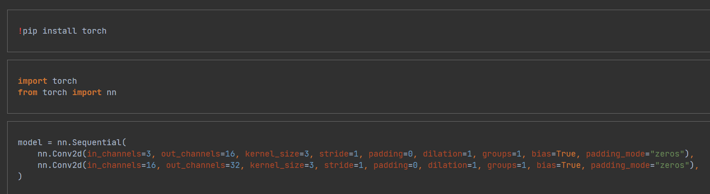

# Server

To run server, you need to execute the following steps:

1. Install python 3.10
2. Install all the requirements from "requirements.txt" (with PyCharm or with the command 'pip install -r "requirements.txt"')
3. Install (if it isn't installed yet) "msvcp140_1.dll" (usually it has already installed; if it's not, python will report it in the next step)
4. Run "src\main.py" (with Pycharm or with the command "python.exe src\main.py")

## API

<details>
<summary>
    <code>POST</code> <b><code>/validate_model/</code></b> Check if a model is correct (try to run one epoch)
</summary>

#### Parameters
> | name              |  type     | data type      | description                         |
> |-------------------|-----------|----------------|-------------------------------------|

#### Request Body Example
```json
{
  "library": "pytorch",
  "blocks": [
    {
      "name": "Conv2d",
      "params": [
        { "name": "in_channels", "value": 3 },
        { "name": "out_channels", "value": 16 },
        { "name": "kernel_size", "value": 3 },
        { "name": "stride", "value": 1 },
        { "name": "padding", "value": 0 },
        { "name": "dilation", "value": 1 },
        { "name": "groups", "value": 1 },
        { "name": "bias", "value": true },
        { "name": "padding_mode", "value": "zeros" }
      ]
    },
    {
      "name": "Conv2d",
      "params": [
        { "name": "in_channels", "value": 16 },
        { "name": "out_channels", "value": 32 },
        { "name": "kernel_size", "value": 3 },
        { "name": "stride", "value": 1 },
        { "name": "padding", "value": 0 },
        { "name": "dilation", "value": 1 },
        { "name": "groups", "value": 1 },
        { "name": "bias", "value": true },
        { "name": "padding_mode", "value": "zeros" }
      ]
    }
  ]
}
```

#### Responses
> | http code     | content-type | response |
> |---------------|--------------|----------|
> | `200`         | -            | -        |
> | `400`         | -            | -        |

##### Response Format

Only HTTP-code:
 - If the model is correct - 200
 - If the model is NOT correct - 400
</details>


<details>
<summary>
    <code>POST</code> <b><code>/get_model/</code></b> Generate a model from JSON and send it back in .ipynb (JSON) format
</summary>

#### Parameters
> | name              |  type     | data type      | description                         |
> |-------------------|-----------|----------------|-------------------------------------|


#### Request Body Example
```json
{
  "library": "pytorch",
  "blocks": [
    {
      "name": "Conv2d",
      "params": [
        { "name": "in_channels", "value": 3 },
        { "name": "out_channels", "value": 16 },
        { "name": "kernel_size", "value": 3 },
        { "name": "stride", "value": 1 },
        { "name": "padding", "value": 0 },
        { "name": "dilation", "value": 1 },
        { "name": "groups", "value": 1 },
        { "name": "bias", "value": true },
        { "name": "padding_mode", "value": "zeros" }
      ]
    },
    {
      "name": "Conv2d",
      "params": [
        { "name": "in_channels", "value": 16 },
        { "name": "out_channels", "value": 32 },
        { "name": "kernel_size", "value": 3 },
        { "name": "stride", "value": 1 },
        { "name": "padding", "value": 0 },
        { "name": "dilation", "value": 1 },
        { "name": "groups", "value": 1 },
        { "name": "bias", "value": true },
        { "name": "padding_mode", "value": "zeros" }
      ]
    }
  ]
}
```

#### Responses
> | http code | content-type       | response |
> |-----------|--------------------|----------|
> | `201`     | 'application/json' | JSON     |
> | `400`     | -                  | -        |

##### Response Example

If the model is generated successfully, send it in .ipynb (JSON) format:

<b>.ipynb:</b>


<b>Raw:</b>
```json
{
  "nbformat": 4,
  "nbformat_minor": 0,
  "metadata": {
    "colab": {
      "provenance": []
    },
    "kernelspec": {
      "name": "python3",
      "display_name": "Python 3"
    },
    "language_info": {
      "name": "python"
    }
  },
  "cells": [
    {
      "cell_type": "code",
      "execution_count": null,
      "metadata": {
        "id": "enKMdK1o7zP5"
      },
      "outputs": [],
      "source": [
        "!pip install torch"
      ]
    },
    {
      "cell_type": "code",
      "source": [
        "import torch\n", "from torch import nn"
      ],
      "metadata": {
        "id": "PLpiWwmr8Can"
      },
      "execution_count": null,
      "outputs": []
    },
    {
      "cell_type": "code",
      "source": [
        "model = nn.Sequential(\n", "\tnn.Conv2d(in_channels=3, out_channels=16, kernel_size=3, stride=1, padding=0, dilation=1, groups=1, bias=True, padding_mode=\"zeros\"),\n", "\tnn.Conv2d(in_channels=16, out_channels=32, kernel_size=3, stride=1, padding=0, dilation=1, groups=1, bias=True, padding_mode=\"zeros\"),\n", ")"
      ],
      "metadata": {
        "id": "CB7SrpDR77wZ"
      },
      "execution_count": null,
      "outputs": []
    }
  ]
}
```
Else: the server sends HTTP-code 400
</details>
